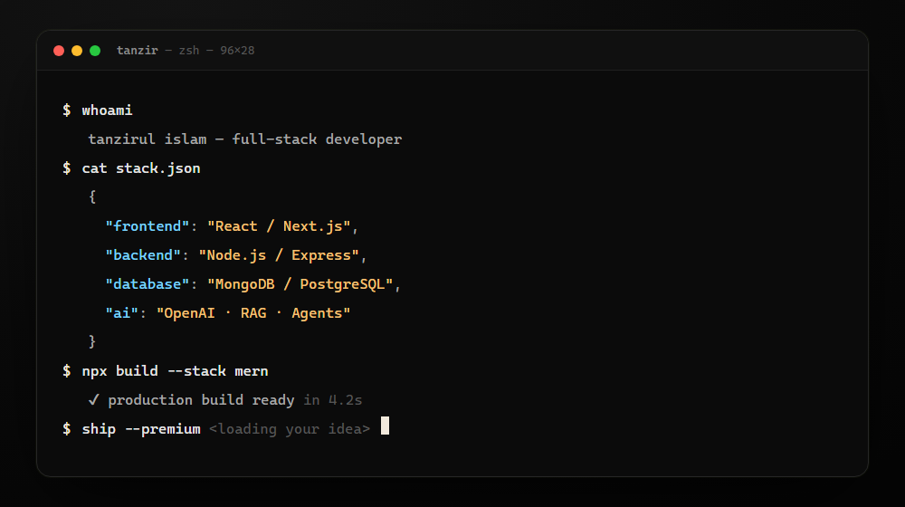
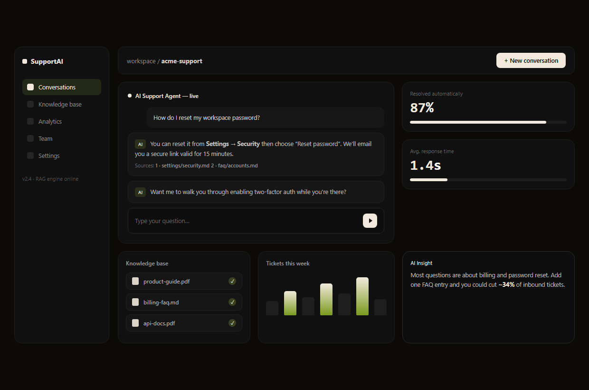
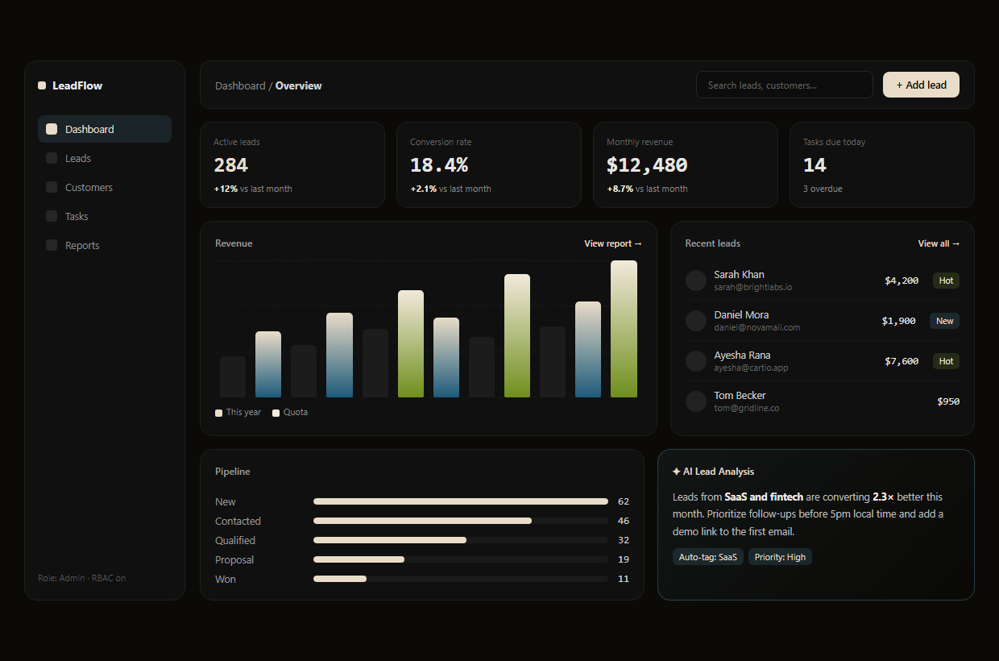

<p align="center">
  <a href="https://tanzirul-islam.vercel.app">
    
  </a>
</p>

<h1 align="center">Tanzir.dev</h1>

<p align="center">
  Personal portfolio of <strong>Tanzirul Islam</strong> — MERN + AI full-stack developer.
  <br />
  A dark, editorial-style one-pager with buttery Framer Motion animations.
</p>

<p align="center">
  <a href="https://tanzirul-islam.vercel.app"><b>🌐 Live demo</b></a> ·
  <a href="https://github.com/TanzirulIslam22/">GitHub</a> ·
  <a href="https://www.linkedin.com/in/tanzirulislam22/">LinkedIn</a> ·
  <a href="public/resume.pdf">Resume</a>
</p>

<p align="center">
  
  
  
  
  
  
  
</p>

---

## 📌 Table of Contents

- [Features](#-features)
- [Interactions & Motion](#-interactions--motion)
- [Tech Stack](#-tech-stack)
- [Screenshots](#-screenshots)
- [Project Structure](#-project-structure)
- [Getting Started](#-getting-started)
- [Content & Customization](#-content--customization)
- [Deployment](#-deployment)
- [Scripts](#-scripts)
- [Contributing](#-contributing)
- [Acknowledgments](#-acknowledgments)
- [License](#-license)

---

## ✨ Features

- **Editorial dark design** — warm-black background with cream accents, outline typography and a subtle film-grain overlay
- **Animated preloader** — letter-by-letter name reveal with a live progress bar, then a smooth slide-up exit
- **Custom cursor** — spring-following dot + ring that expands over interactive elements (fine-pointer devices only)
- **Interactive hero terminal** — a "tanzir.dev — bash" window with three tabs (`MERN stack`, `AI RAG`, `Backend`) that switch content with staggered line reveals, a blinking cursor and a 3D mouse-tilt
- **Magnetic buttons** — call-to-action buttons that gently pull toward the cursor
- **Scroll-triggered animations** via Framer Motion, fully honoring `prefers-reduced-motion`
- **Six numbered sections** — About, Skills, Selected Work, Experiments, Services and Contact
- **Editorial project rows** — alternating layout with hover-glow project screenshots
- **Marquee strips** — outlined tech marquee under the hero and a giant name marquee in the footer
- **Fully responsive** with a full-screen mobile menu
- **SEO-ready** — metadata, Open Graph, sitemap, robots.txt and an SVG favicon

## 🎬 Interactions & Motion

| Interaction | Where |
| --- | --- |
| Letter-mask hero headline reveal | `components/Hero.tsx` |
| Rotating role words ("AI-powered", "MERN", ...) | `components/Hero.tsx` |
| 3D tilt on the terminal card | `components/Hero.tsx` |
| Interactive stack tabs | `components/Terminal.tsx` |
| Magnetic hover on CTAs | `components/ui/MagneticButton.tsx` |
| Custom cursor (dot + ring) | `components/Cursor.tsx` |
| Preloader name reveal + progress | `components/Preloader.tsx` |
| Scroll progress bar | `components/ui/ScrollProgress.tsx` |
| Marquee keyframes | `app/globals.css` |

## 🛠 Tech Stack

- **Framework:** Next.js 16 (App Router, Turbopack)
- **UI:** React 19, Tailwind CSS 4, Framer Motion
- **Language:** TypeScript
- **Icons:** lucide-react
- **Fonts:** Syne (display) + Manrope (sans), served via `next/font`
- **Image optimization:** `sharp`

## 📸 Screenshots

<p align="center">
  
  <br />
  <em>AI Customer Support Platform — featured project</em>
</p>

<p align="center">
  
  <br />
  <em>CRM Dashboard — featured project</em>
</p>

> All project screenshots are generated from hand-built HTML mockups in `tools/mockups/`, so they always look crisp and on-brand.

## 📁 Project Structure

```
.
├── app/                  # Pages, layout, metadata, global styles
│   ├── globals.css       # Design tokens, utilities, keyframes
│   ├── layout.tsx        # Root layout, fonts, SEO metadata
│   ├── page.tsx          # Home page composition
│   ├── icon.svg          # Favicon
│   └── sitemap.ts        # Sitemap
├── components/           # Navbar, Hero, Terminal, sections, Preloader, Cursor, Footer...
│   ├── sections/         # About, Skills, Projects, Experiments, Services, Contact
│   └── ui/               # MagneticButton, ScrollProgress, SectionHeading
├── lib/                  # Content data + animation helpers
├── public/               # Project screenshots, resume.pdf, robots.txt
├── scripts/              # Production smoke test
└── tools/mockups/        # HTML sources for the generated screenshots
```

## 🚀 Getting Started

Requires **Node.js 18.18+** (or 20+).

```bash
# 1. Install dependencies
npm install

# 2. Start the dev server
npm run dev
```

Open [http://localhost:3000](http://localhost:3000) — done. 🎉

### Production build

```bash
npm run build
npm run start
```

### Type check

```bash
npm run typecheck
```

## ✏️ Content & Customization

All copy lives in **`lib/data.ts`** — profile, stats, hero words, skills, projects, mini projects, services, values and social links. Edit it to customize the entire site.

A `.env.example` file is provided — copy it to `.env.local` if you want to override the public site URL used for metadata/sitemap:

```bash
cp .env.example .env.local
```

## ☁️ Deployment

The site is deployed on **Vercel**:

```bash
vercel --prod
```

Every push to `main` triggers a production build automatically. The `vercel.json` preset is included.

## 📜 Scripts

| Script | Description |
| --- | --- |
| `npm run dev` | Start the dev server |
| `npm run build` | Create a production build |
| `npm run start` | Serve the production build |
| `npm run typecheck` | Run TypeScript checks |
| `npm run smoke` | Smoke-test a running production server |

## 🤝 Contributing

This is a personal portfolio, but feedback and ideas are always welcome:

1. Fork the repository
2. Create your feature branch (`git checkout -b feature/amazing-idea`)
3. Commit your changes (`git commit -m 'feat: add amazing idea'`)
4. Push to the branch (`git push origin feature/amazing-idea`)
5. Open a pull request

## 🙏 Acknowledgments

- [Vercel](https://vercel.com) for hosting
- [Next.js](https://nextjs.org), [Tailwind CSS](https://tailwindcss.com) and [Framer Motion](https://www.framer.com/motion/) for the foundation
- [Syne](https://fonts.google.com/specimen/Syne) & [Manrope](https://fonts.google.com/specimen/Manrope) for the typography

## 📄 License

[MIT](LICENSE) © [Tanzirul Islam](https://github.com/TanzirulIslam22/)
